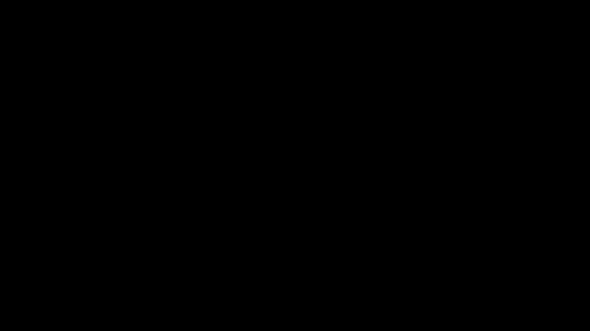

# Tutorial de Manim - Gráficos y Animaciones de Funciones

Este documento contiene ejemplos de código Manim para crear gráficos, funciones animadas y ondas.

---

## 1. Gráfico Básico - Función Exponencial

Crea un sistema de ejes y grafica una función exponencial.

```python
from manim import *
import numpy as np

class Plot1(Scene):
    def construct(self):
        ejes=Axes(x_range=[-7, 7, 0.5],
                  y_range=[-50, 50, 5],
                  axis_config={
                      "color": BLUE,
                  },

                  x_axis_config={
                      "numbers_to_include": np.arange(2, 7.5, 1.5),
                  },
                  y_axis_config={"numbers_to_include": np.arange(0, 60, 15),},
                  )
        labels=ejes.get_axis_labels(MathTex("x", color= RED), MathTex("y", color=RED))
        
        graph = ejes.plot( lambda x: 2*np.e**x, x_range=[-7, 7], color=GREEN )

        self.play(Create(ejes))
        self.play(Create(graph), run_time=2)
        self.play(Write(labels))
        self.wait(2)
```

<p align="center"></p>

**Características:**
- Ejes configurables con rangos personalizados
- Números específicos en los ejes
- Función exponencial: `y = 2e^x`
- Colores personalizados para ejes, gráfico y etiquetas

---

## 2. Función Seno con Etiquetas en π

Grafica la función seno con marcadores en múltiplos de π.

```python
class Plot2(Scene):
    def construct(self):
        axes = Axes(
            x_range=[-2*np.pi, 2*np.pi, np.pi/2],
            y_range=[-1.5, 1.5, 0.5],
            axis_config={
                "color": BLUE,
                "include_numbers": False,  
            },
            tips=False,
        )

        # Etiquetas en π (solo estas aparecen)
        axes.get_x_axis().add_labels({
            -2*np.pi: MathTex(r"-2\pi"),
            -np.pi: MathTex(r"-\pi"),
            0: MathTex("0"),
            np.pi: MathTex(r"\pi"),
            2*np.pi: MathTex(r"2\pi"),
        })

        labels = axes.get_axis_labels(
            MathTex("x", color=RED),
            MathTex(r"\sin x", color=RED)
        )

        seno = axes.plot(lambda x: np.sin(x), color=GREEN)

        self.play(Create(axes))
        self.play(Create(seno), run_time=2)
        self.play(Write(labels))
        self.wait()
```

<p align="center"></p>

**Características:**
- Etiquetas personalizadas en múltiplos de π
- Función trigonométrica: `y = sin(x)`
- Ejes sin flechas (`tips=False`)

---

## 3. Seno con Fase Animada

Anima una función seno con cambio de fase en tiempo real.

```python
class SenoConFase(Scene):
    def construct(self):
        # Ejes
        axes = Axes(
            x_range=[-2*np.pi, 2*np.pi, np.pi/2],
            y_range=[-1.5, 1.5, 0.5],
            axis_config={
                "color": BLUE,
                "include_numbers": False,
            },
            tips=False,
        )

        # Etiquetas en π
        axes.get_x_axis().add_labels({
            -2*np.pi: MathTex(r"-2\pi"),
            -np.pi: MathTex(r"-\pi"),
            0: MathTex("0"),
            np.pi: MathTex(r"\pi"),
            2*np.pi: MathTex(r"2\pi"),
        })

        labels = axes.get_axis_labels(
            MathTex(r"x", color=RED),
            MathTex(r"\sin(x+\phi)", color=RED)
        )

        # Parámetro de fase
        phi = ValueTracker(0)

        # Seno animado
        seno = always_redraw(
            lambda: axes.plot(
                lambda x: np.sin(x + phi.get_value()),
                color=GREEN
            )
        )

        self.play(Create(axes), Write(labels))
        self.add(seno)

        # Animación de la fase
        self.play(
            phi.animate.set_value(2 * np.pi),
            run_time=6,
            rate_func=linear
        )

        self.wait()
```

<p align="center"></p>

**Características:**
- Uso de `ValueTracker` para parámetros animables
- `always_redraw()` para actualizar el gráfico en cada frame
- Función animada: `y = sin(x + φ)` donde φ varía de 0 a 2π
- Animación suave con `rate_func=linear`

---

## 4. Onda Viajera

Simula una onda propagándose en el espacio y el tiempo.

```python
class OndaViajera(Scene):
    def construct(self):
        # Parámetros físicos
        A = 1          # amplitud
        k = 1          # número de onda
        omega = 1      # frecuencia angular

        # Ejes
        axes = Axes(
            x_range=[-2*np.pi, 2*np.pi, np.pi/2],
            y_range=[-1.5, 1.5, 0.5],
            axis_config={
                "color": BLUE,
                "include_numbers": False,
            },
            tips=False,
        )

        # Etiquetas en π
        axes.get_x_axis().add_labels({
            -2*np.pi: MathTex(r"-2\pi"),
            -np.pi: MathTex(r"-\pi"),
            0: MathTex("0"),
            np.pi: MathTex(r"\pi"),
            2*np.pi: MathTex(r"2\pi"),
        })

        labels = axes.get_axis_labels(
            MathTex("x", color=RED),
            MathTex("y", color=RED)
        )

        # Tiempo
        t = ValueTracker(0)

        # Onda viajera
        onda = always_redraw(
            lambda: axes.plot(
                lambda x: A * np.sin(k * x - omega * t.get_value()),
                color=GREEN
            )
        )

        self.play(Create(axes), Write(labels))
        self.add(onda)

        # Animación temporal
        self.play(
            t.animate.set_value(4 * np.pi),
            run_time=8,
            rate_func=linear
        )

        self.wait()
```

<p align="center"></p>

**Características:**
- Ecuación de onda viajera: `y = A·sin(kx - ωt)`
- Parámetros físicos: amplitud (A), número de onda (k), frecuencia angular (ω)
- La onda se propaga hacia la derecha
- Animación en tiempo real

---

## 5. Superposición de Ondas

Visualiza la superposición de dos ondas viajeras opuestas formando una onda estacionaria.

```python
class SuperposicionOndas(Scene):
    def construct(self):
        # Parámetros físicos
        A = 1
        k = 1
        omega = 1

        # Ejes
        axes = Axes(
            x_range=[-2*np.pi, 2*np.pi, np.pi/2],
            y_range=[-2.5, 2.5, 0.5],
            axis_config={
                "color": BLUE,
                "include_numbers": False,
            },
            tips=False,
        )

        # Etiquetas en π
        axes.get_x_axis().add_labels({
            -2*np.pi: MathTex(r"-2\pi"),
            -np.pi: MathTex(r"-\pi"),
            0: MathTex("0"),
            np.pi: MathTex(r"\pi"),
            2*np.pi: MathTex(r"2\pi"),
        })

        labels = axes.get_axis_labels(
            MathTex("x", color=RED),
            MathTex("y", color=RED)
        )

        # Tiempo
        t = ValueTracker(0)

        # Ondas viajeras
        onda_derecha = always_redraw(
            lambda: axes.plot(
                lambda x: A * np.sin(k*x - omega*t.get_value()),
                color=GREEN
            )
        )

        onda_izquierda = always_redraw(
            lambda: axes.plot(
                lambda x: A * np.sin(k*x + omega*t.get_value()),
                color=ORANGE
            )
        )

        # Superposición
        superposicion = always_redraw(
            lambda: axes.plot(
                lambda x: 2*A * np.sin(k*x) * np.cos(omega*t.get_value()),
                color=YELLOW
            )
        )

        self.play(Create(axes), Write(labels))
        self.add(onda_derecha, onda_izquierda, superposicion)

        self.play(
            t.animate.set_value(4*np.pi),
            run_time=8,
            rate_func=linear
        )

        self.wait()
```

<p align="center"></p>

**Características:**
- Onda viajera derecha (verde): `y = A·sin(kx - ωt)`
- Onda viajera izquierda (naranja): `y = A·sin(kx + ωt)`
- Superposición (amarillo): `y = 2A·sin(kx)·cos(ωt)`
- Muestra el principio de superposición de ondas

---

## 6. Onda Estacionaria con Nodos

Visualiza una onda estacionaria y marca los puntos donde no hay movimiento (nodos).

```python
class OndaConNodos(Scene):
    def construct(self):
        # Parámetros físicos
        A = 1
        k = 1
        omega = 1

        # Ejes
        axes = Axes(
            x_range=[-2*np.pi, 2*np.pi, np.pi/2],
            y_range=[-2.5, 2.5, 0.5],
            axis_config={
                "color": BLUE,
                "include_numbers": False,
            },
            tips=False,
        )

        axes.get_x_axis().add_labels({
            -2*np.pi: MathTex(r"-2\pi"),
            -np.pi: MathTex(r"-\pi"),
            0: MathTex("0"),
            np.pi: MathTex(r"\pi"),
            2*np.pi: MathTex(r"2\pi"),
        })

        labels = axes.get_axis_labels(
            MathTex("x", color=RED),
            MathTex("y", color=RED)
        )

        # Tiempo
        t = ValueTracker(0)

        # Onda estacionaria
        onda = always_redraw(
            lambda: axes.plot(
                lambda x: 2*A*np.sin(k*x)*np.cos(omega*t.get_value()),
                color=YELLOW
            )
        )

        # ===== NODOS AUTOMÁTICOS =====
        # x_n = n*pi/k dentro del rango
        n_vals = np.arange(-2, 3)   # ajusta si cambias el rango
        nodos = VGroup(*[
            Dot(
                axes.coords_to_point(n*np.pi/k, 0),
                color=RED,
                radius=0.06
            )
            for n in n_vals
        ])

        # Etiqueta opcional
        texto_nodos = MathTex(r"\text{Nodos}", color=RED).to_corner(UR)

        self.play(Create(axes), Write(labels))
        self.add(onda)
        self.play(FadeIn(nodos), Write(texto_nodos))

        self.play(
            t.animate.set_value(4*np.pi),
            run_time=8,
            rate_func=linear
        )

        self.wait()
```
<p align="center"></p>

**Características:**
- Onda estacionaria: `y = 2A·sin(kx)·cos(ωt)`
- Nodos marcados con puntos rojos en posiciones: `x_n = nπ/k`
- Los nodos son puntos que permanecen estáticos mientras la onda oscila
- Cálculo automático de posiciones de nodos usando `VGroup`

---

## Conceptos Clave

### ValueTracker
Permite animar parámetros numéricos de forma suave:
```python
phi = ValueTracker(0)
self.play(phi.animate.set_value(2*np.pi), run_time=6)
```

### always_redraw()
Redibuja un objeto en cada frame, útil para animaciones continuas:
```python
onda = always_redraw(
    lambda: axes.plot(lambda x: np.sin(x + phi.get_value()), color=GREEN)
)
```

### Configuración de Ejes
- `x_range`, `y_range`: Define el dominio y rango
- `axis_config`: Configuración general (color, números)
- `add_labels()`: Etiquetas personalizadas en posiciones específicas

### Funciones Lambda
Permite definir funciones matemáticas directamente:
```python
axes.plot(lambda x: np.sin(x), color=GREEN)
```

---

## Comandos de Renderizado

```bash
# Calidad baja (rápido para pruebas)
manim -pql archivo.py NombreDeLaClase

# Calidad media
manim -pqm archivo.py NombreDeLaClase

# Calidad alta (para producción)
manim -pqh archivo.py NombreDeLaClase

# Generar GIF
manim -pql archivo.py NombreDeLaClase --format=gif
```

---

## Recursos

- [Documentación de Manim - Axes](https://docs.manim.community/en/stable/reference/manim.mobject.graphing.coordinate_systems.Axes.html)
- [Documentación - ValueTracker](https://docs.manim.community/en/stable/reference/manim.mobject.value_tracker.ValueTracker.html)
- [Tutoriales de Animación](https://docs.manim.community/en/stable/tutorials/index.html)
- [Galería de Ejemplos](https://docs.manim.community/en/stable/examples.html)